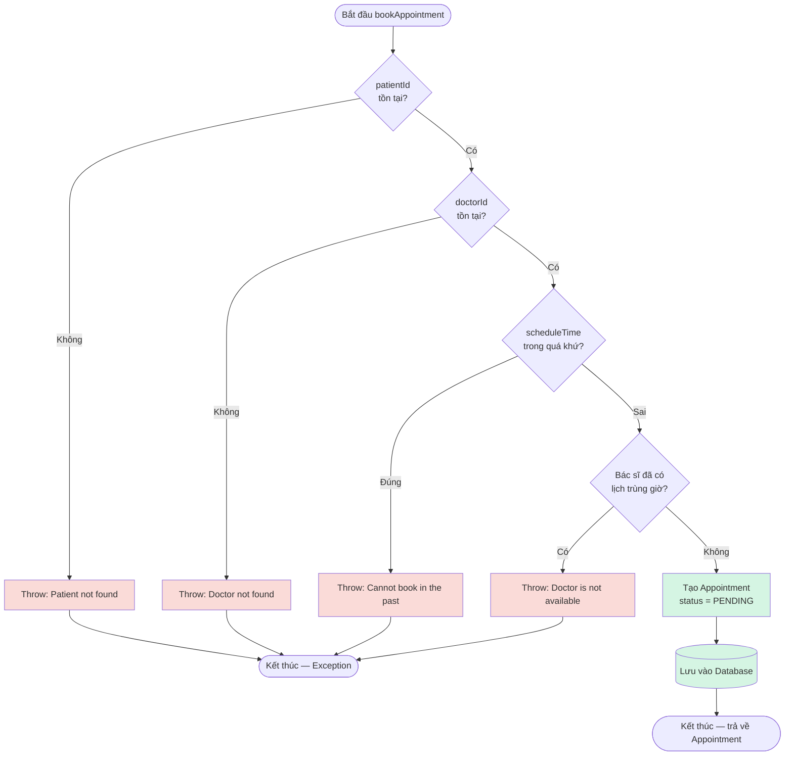
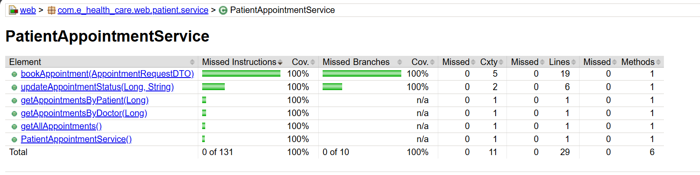
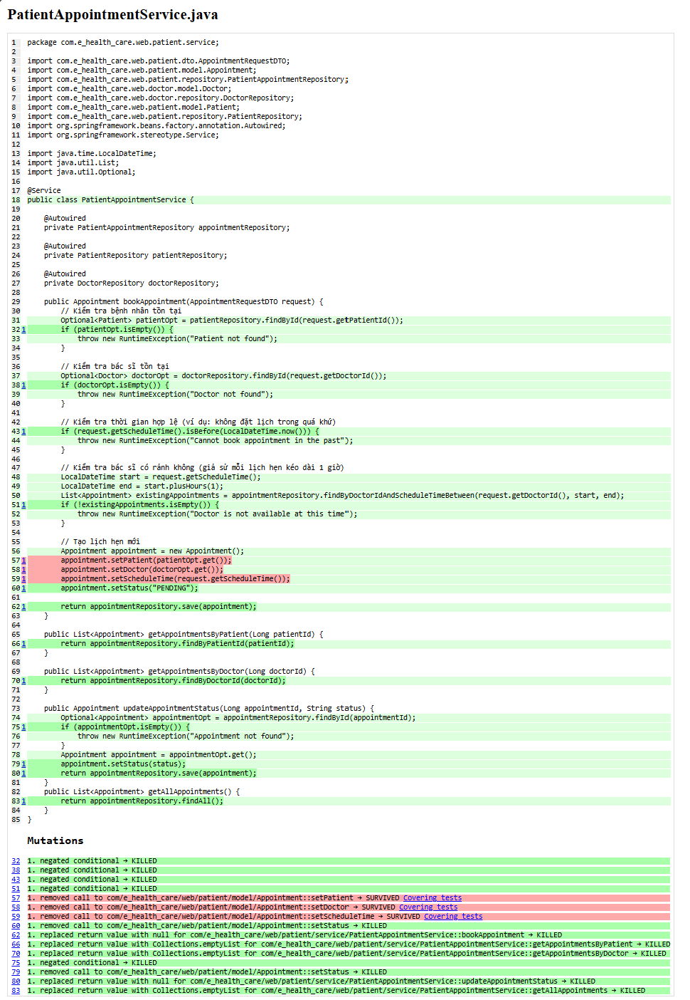
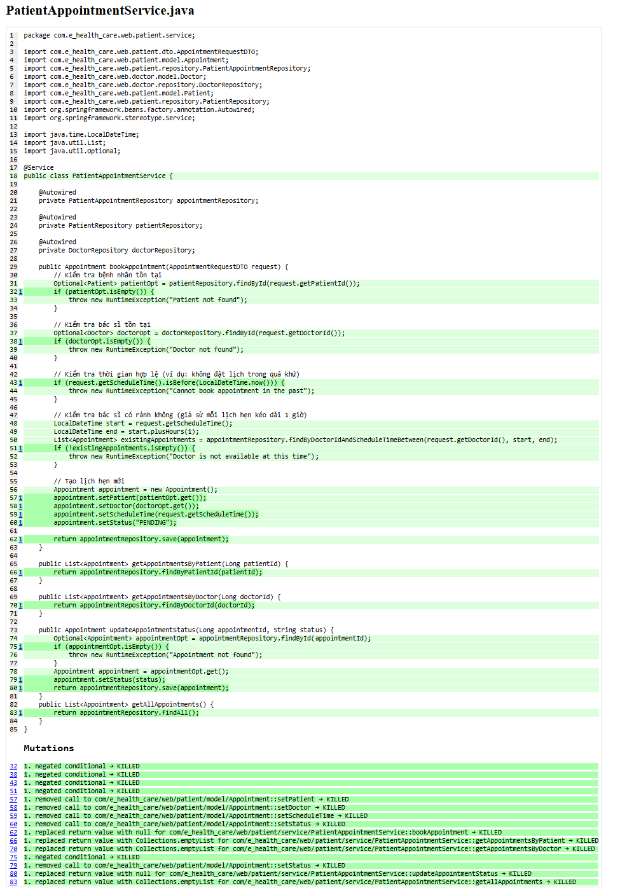

# Báo Cáo Kiểm Thử: Chức Năng Đặt Lịch Khám (Patient Appointment Booking)

| | |
|---|---|
| **Module** | E-HealthCare System — `PatientAppointmentService` |
| **Tác giả** | Trần Đông Hil |
| **Jira Task** | EHC-50 (Black-box: EP/BVA), EHC-40 (Black-box: State Transition) |
| **Kỹ thuật áp dụng** | Equivalence Partitioning, Boundary Value Analysis, State Transition Testing, White-box Coverage Analysis |
| **Công cụ** | JUnit 5, Mockito, JaCoCo 0.8.12 |
| **Ngày thực hiện** | 28/06/2026 |
| **Trạng thái** | Hoàn thành — 17/17 test PASS, 100% Line & Branch Coverage |

---

## Mục Lục

- [Báo Cáo Kiểm Thử: Chức Năng Đặt Lịch Khám (Patient Appointment Booking)](#báo-cáo-kiểm-thử-chức-năng-đặt-lịch-khám-patient-appointment-booking)
  - [Mục Lục](#mục-lục)
  - [1. Mục tiêu kiểm thử](#1-mục-tiêu-kiểm-thử)
  - [2. Đặc tả chức năng](#2-đặc-tả-chức-năng)
  - [3. Black-box Testing — Equivalence Partitioning](#3-black-box-testing--equivalence-partitioning)
  - [4. Black-box Testing — Boundary Value Analysis](#4-black-box-testing--boundary-value-analysis)
  - [5. Thiết kế Test Case](#5-thiết-kế-test-case)
    - [State Transition Testing — `updateAppointmentStatus()` (EHC-40)](#state-transition-testing--updateappointmentstatus-ehc-40)
  - [6. White-box Testing — Control Flow Graph](#6-white-box-testing--control-flow-graph)
    - [Tính Cyclomatic Complexity](#tính-cyclomatic-complexity)
    - [Independent Paths (Basis Path Testing)](#independent-paths-basis-path-testing)
  - [7. Triển khai Unit Test](#7-triển-khai-unit-test)
  - [8. Kết quả Code Coverage (JaCoCo)](#8-kết-quả-code-coverage-jacoco)
  - [8b. Mutation Testing với PIT — Phát hiện và khắc phục lỗ hổng test](#8b-mutation-testing-với-pit--phát-hiện-và-khắc-phục-lỗ-hổng-test)
    - [Tại sao cần làm thêm bước này?](#tại-sao-cần-làm-thêm-bước-này)
    - [Lần chạy đầu tiên — phát hiện vấn đề](#lần-chạy-đầu-tiên--phát-hiện-vấn-đề)
    - [Hành động khắc phục](#hành-động-khắc-phục)
    - [Lần chạy thứ hai — sau khi khắc phục](#lần-chạy-thứ-hai--sau-khi-khắc-phục)
    - [Hành động khắc phục](#hành-động-khắc-phục-1)
    - [Lần chạy 2 — Sau khi fix (Retest)](#lần-chạy-2--sau-khi-fix-retest)
    - [So sánh trước/sau](#so-sánh-trướcsau)
  - [9. Bảng Tag Coverage](#9-bảng-tag-coverage)
  - [10. Kết luận](#10-kết-luận)

---

## 1. Mục tiêu kiểm thử

| # | Mục tiêu |
|---|---|
| 1 | Xác định điều kiện kiểm thử từ logic nghiệp vụ thật của `bookAppointment()` và `updateAppointmentStatus()` |
| 2 | Áp dụng **Equivalence Partitioning** chia 4 biến đầu vào thành lớp hợp lệ/không hợp lệ |
| 3 | Áp dụng **Boundary Value Analysis** cho biến liên tục `scheduleTime` |
| 4 | Áp dụng **State Transition Testing** cho `Appointment.status` |
| 5 | Đo **Code Coverage** thật bằng JaCoCo, đối chiếu với thiết kế test case (White-box) |

---

## 2. Đặc tả chức năng

Hệ thống cho phép bệnh nhân đặt lịch khám với bác sĩ. Yêu cầu được xem là **hợp lệ** khi tất cả điều kiện sau đồng thời thỏa mãn:

| Biến đầu vào | Ý nghĩa | Điều kiện hợp lệ | Vị trí trong code |
|---|---|---|---|
| `patientId` | ID bệnh nhân | Tồn tại trong bảng `patient` | `PatientAppointmentService.java:31` |
| `doctorId` | ID bác sĩ | Tồn tại trong bảng `doctor` | `PatientAppointmentService.java:37` |
| `scheduleTime` | Thời điểm hẹn khám | Ở tương lai (> hiện tại) | `PatientAppointmentService.java:43` |
| Doctor availability | Bác sĩ rảnh tại `scheduleTime` | Không trùng appointment khác trong khung `[t, t+1h]` | `PatientAppointmentService.java:51` |

**Công thức logic:**

```
BookingValid = (patientId ∈ Patient) AND (doctorId ∈ Doctor)
               AND (scheduleTime > now()) AND (DoctorAvailable)
```

---

## 3. Black-box Testing — Equivalence Partitioning

| Conditions | Valid Partitions | Tag | Invalid Partitions | Tag |
|---|---|---|---|---|
| `patientId` | Tồn tại trong DB | V1 | Không tồn tại | X1 |
| `doctorId` | Tồn tại trong DB | V2 | Không tồn tại | X2 |
| `scheduleTime` | Ở tương lai | V3 | Ở quá khứ | X3 |
| | | | Bằng đúng thời điểm hiện tại | X4 |
| Doctor availability | Không trùng lịch | V4 | Trùng lịch với appointment khác | X5 |

---

## 4. Black-box Testing — Boundary Value Analysis

Áp dụng BVA cho `scheduleTime` — biến duy nhất có miền giá trị liên tục với ranh giới rõ ràng tại `now()`.

| Biến đầu vào | min- | min (boundary) | min+ | nominal | max (nghiệp vụ) | Tag biên |
|---|---|---|---|---|---|---|
| `scheduleTime` | now() − 1s | now() | now() + 1s | now() + 1 ngày | now() + 30 ngày | B1–B5 |

> **Ghi chú kỹ thuật:** `isBefore()` trong Java không bao gồm trường hợp bằng nhau, nhưng do độ trễ thực thi giữa lúc tạo request và lúc kiểm tra, giá trị `scheduleTime = now()` trong thực tế luôn rơi vào nhánh bị từ chối (B2 → invalid).

---

## 5. Thiết kế Test Case

| Test Case | Input (patientId, doctorId, scheduleTime, doctorBusy) | Expected Outcome | Tags |
|---|---|---|---|
| TC01 | (1, 1, now()+1 ngày, false) | ✅ Hợp lệ — tạo Appointment `PENDING` | V1,V2,V3,V4 |
| TC02 | (999, 1, now()+1 ngày, false) | ❌ "Patient not found" | X1 |
| TC03 | (1, 999, now()+1 ngày, false) | ❌ "Doctor not found" | X2 |
| TC04 | (1, 1, now()−1s, false) | ❌ "Cannot book appointment in the past" | X3, B1 |
| TC05 | (1, 1, now(), false) | ❌ "Cannot book appointment in the past" | X4, B2 |
| TC06 | (1, 1, now()+1s, false) | ✅ Hợp lệ — biên gần nhất | B3 |
| TC07 | (1, 1, now()+1 ngày, true) | ❌ "Doctor is not available at this time" | X5 |
| TC08 | (1, 1, now()+30 ngày, false) | ✅ Hợp lệ — biên xa nghiệp vụ | B5 |
| TC09 | (999, 999, now()−1s, true) | ❌ "Patient not found" (lỗi đầu tiên trong thứ tự if) | X1 (ưu tiên) |
| TC10 | `getAppointmentsByPatient(1L)` | Trả về danh sách appointment của bệnh nhân | — |
| TC11 | `getAppointmentsByDoctor(1L)` | Trả về danh sách appointment của bác sĩ | — |
| TC12 | `getAllAppointments()` | Trả về toàn bộ danh sách appointment | — |

### State Transition Testing — `updateAppointmentStatus()` (EHC-40)

| Test Case | Transition | Expected | Status |
|---|---|---|---|
| STT-01 | PENDING → CONFIRMED | ✅ Valid | PASS |
| STT-02 | PENDING → CANCELLED | ✅ Valid | PASS |
| STT-03 | CONFIRMED → COMPLETED | ✅ Valid | PASS |
| STT-04 | CONFIRMED → CANCELLED | ✅ Valid | PASS |
| STT-05 | CANCELLED → PENDING | ⚠️ Hệ thống chấp nhận (Defect-01) | PASS* |
| STT-06 | COMPLETED → PENDING | ⚠️ Hệ thống chấp nhận (Defect-02) | PASS* |
| STT-07 | COMPLETED → CONFIRMED | ⚠️ Hệ thống chấp nhận (Defect-03) | PASS* |
| STT-08 | Appointment không tồn tại | ❌ Throw exception | PASS |

\* *PASS theo nghĩa xác nhận đúng hành vi thực tế của code — không phải hành vi đúng theo nghiệp vụ. 3 defect này đã được log thành Bug ticket riêng trên Jira, link `relates to` EHC-40.*

---

## 6. White-box Testing — Control Flow Graph

Sơ đồ luồng điều khiển (Control Flow Graph) của `bookAppointment()`, dùng để tính **Cyclomatic Complexity** và xác định **Independent Path**.



### Tính Cyclomatic Complexity

```
V(G) = E - N + 2
```

Với 4 điểm quyết định (decision points: `CheckPatient`, `CheckDoctor`, `CheckTime`, `CheckBusy`):

```
V(G) = 4 + 1 = 5
```

→ Khớp với số liệu đo thực tế từ JaCoCo: **Cxty = 5** (xem mục 8).

### Independent Paths (Basis Path Testing)

| Path | Đường đi | Test case tương ứng |
|---|---|---|
| Path 1 | Start → CheckPatient(Không) → ThrowPatient | TC02 |
| Path 2 | Start → CheckPatient(Có) → CheckDoctor(Không) → ThrowDoctor | TC03 |
| Path 3 | Start → ... → CheckTime(Đúng) → ThrowPast | TC04, TC05 |
| Path 4 | Start → ... → CheckBusy(Có) → ThrowBusy | TC07 |
| Path 5 | Start → ... → CheckBusy(Không) → CreateAppt → SaveDb → End | TC01, TC06, TC08 |

**5 Independent Path = Cyclomatic Complexity = 5** → đủ điều kiện Basis Path Coverage tối thiểu, đã được cover đầy đủ bởi 9 test case (TC01–TC09).

---

## 7. Triển khai Unit Test

```java
package com.e_health_care.web.patient.service;

import com.e_health_care.web.BaseServiceTest;
import com.e_health_care.web.doctor.model.Doctor;
import com.e_health_care.web.doctor.repository.DoctorRepository;
import com.e_health_care.web.patient.dto.AppointmentRequestDTO;
import com.e_health_care.web.patient.model.Appointment;
import com.e_health_care.web.patient.model.Patient;
import com.e_health_care.web.patient.repository.PatientAppointmentRepository;
import com.e_health_care.web.patient.repository.PatientRepository;
import org.junit.jupiter.api.DisplayName;
import org.junit.jupiter.api.Test;
import org.mockito.InjectMocks;
import org.mockito.Mock;

import java.time.LocalDateTime;
import java.util.List;
import java.util.Optional;

import static org.junit.jupiter.api.Assertions.*;
import static org.mockito.Mockito.*;

/**
 * Equivalence Partitioning + Boundary Value Analysis
 * cho bookAppointment() — PatientAppointmentService
 *
 * Tag mapping:
 *   V1=patientId hợp lệ       X1=patientId không tồn tại
 *   V2=doctorId hợp lệ        X2=doctorId không tồn tại
 *   V3=scheduleTime tương lai X3=scheduleTime quá khứ   X4=scheduleTime=now()
 *   V4=doctor rảnh            X5=doctor đã có lịch khác
 *   B1=now()-1s  B2=now()  B3=now()+1s  B5=now()+30 ngày
 */
class JIRABookAppointmentEpBvaTest extends BaseServiceTest {

    @Mock private PatientAppointmentRepository appointmentRepository;
    @Mock private PatientRepository patientRepository;
    @Mock private DoctorRepository doctorRepository;

    @InjectMocks
    private PatientAppointmentService service;

    private AppointmentRequestDTO request(Long patientId, Long doctorId, LocalDateTime time) {
        AppointmentRequestDTO dto = new AppointmentRequestDTO();
        dto.setPatientId(patientId);
        dto.setDoctorId(doctorId);
        dto.setScheduleTime(time);
        return dto;
    }

    @Test
    @DisplayName("TC01 [V1,V2,V3,V4]: tất cả điều kiện hợp lệ -> tạo appointment PENDING")
    void tc01_allValid_shouldCreateAppointment() {
        when(patientRepository.findById(1L)).thenReturn(Optional.of(new Patient()));
        when(doctorRepository.findById(1L)).thenReturn(Optional.of(new Doctor()));
        when(appointmentRepository.findByDoctorIdAndScheduleTimeBetween(any(), any(), any()))
                .thenReturn(List.of());
        when(appointmentRepository.save(any())).thenAnswer(inv -> inv.getArgument(0));

        Appointment result = service.bookAppointment(
                request(1L, 1L, LocalDateTime.now().plusDays(1)));

        assertEquals("PENDING", result.getStatus());
    }

    @Test
    @DisplayName("TC02 [X1]: patientId không tồn tại -> throw 'Patient not found'")
    void tc02_patientNotFound_shouldThrow() {
        when(patientRepository.findById(999L)).thenReturn(Optional.empty());

        Exception ex = assertThrows(RuntimeException.class, () ->
                service.bookAppointment(request(999L, 1L, LocalDateTime.now().plusDays(1))));
        assertEquals("Patient not found", ex.getMessage());
    }

    @Test
    @DisplayName("TC03 [X2]: doctorId không tồn tại -> throw 'Doctor not found'")
    void tc03_doctorNotFound_shouldThrow() {
        when(patientRepository.findById(1L)).thenReturn(Optional.of(new Patient()));
        when(doctorRepository.findById(999L)).thenReturn(Optional.empty());

        Exception ex = assertThrows(RuntimeException.class, () ->
                service.bookAppointment(request(1L, 999L, LocalDateTime.now().plusDays(1))));
        assertEquals("Doctor not found", ex.getMessage());
    }

    @Test
    @DisplayName("TC04 [X3,B1]: scheduleTime = now()-1s -> throw 'Cannot book in the past'")
    void tc04_scheduleTimeBeforeBoundary_shouldThrow() {
        when(patientRepository.findById(1L)).thenReturn(Optional.of(new Patient()));
        when(doctorRepository.findById(1L)).thenReturn(Optional.of(new Doctor()));

        Exception ex = assertThrows(RuntimeException.class, () ->
                service.bookAppointment(request(1L, 1L, LocalDateTime.now().minusSeconds(1))));
        assertEquals("Cannot book appointment in the past", ex.getMessage());
    }

    @Test
    @DisplayName("TC05 [X4,B2]: scheduleTime = now() -> throw (do độ trễ thực thi)")
    void tc05_scheduleTimeExactlyNow_shouldThrow() {
        when(patientRepository.findById(1L)).thenReturn(Optional.of(new Patient()));
        when(doctorRepository.findById(1L)).thenReturn(Optional.of(new Doctor()));

        LocalDateTime now = LocalDateTime.now();
        Exception ex = assertThrows(RuntimeException.class, () ->
                service.bookAppointment(request(1L, 1L, now)));
        assertEquals("Cannot book appointment in the past", ex.getMessage());
    }

    @Test
    @DisplayName("TC06 [B3]: scheduleTime = now()+1s -> hợp lệ (biên tương lai gần nhất)")
    void tc06_scheduleTimeJustAfterNow_shouldSucceed() {
        when(patientRepository.findById(1L)).thenReturn(Optional.of(new Patient()));
        when(doctorRepository.findById(1L)).thenReturn(Optional.of(new Doctor()));
        when(appointmentRepository.findByDoctorIdAndScheduleTimeBetween(any(), any(), any()))
                .thenReturn(List.of());
        when(appointmentRepository.save(any())).thenAnswer(inv -> inv.getArgument(0));

        Appointment result = service.bookAppointment(
                request(1L, 1L, LocalDateTime.now().plusSeconds(2)));

        assertEquals("PENDING", result.getStatus());
    }

    @Test
    @DisplayName("TC07 [X5]: doctor đã có appointment khác cùng khung giờ -> throw 'not available'")
    void tc07_doctorBusy_shouldThrow() {
        when(patientRepository.findById(1L)).thenReturn(Optional.of(new Patient()));
        when(doctorRepository.findById(1L)).thenReturn(Optional.of(new Doctor()));
        when(appointmentRepository.findByDoctorIdAndScheduleTimeBetween(any(), any(), any()))
                .thenReturn(List.of(new Appointment()));

        Exception ex = assertThrows(RuntimeException.class, () ->
                service.bookAppointment(request(1L, 1L, LocalDateTime.now().plusDays(1))));
        assertEquals("Doctor is not available at this time", ex.getMessage());
    }

    @Test
    @DisplayName("TC08 [B5]: scheduleTime = now()+30 ngày -> hợp lệ")
    void tc08_scheduleTimeFarFuture_shouldSucceed() {
        when(patientRepository.findById(1L)).thenReturn(Optional.of(new Patient()));
        when(doctorRepository.findById(1L)).thenReturn(Optional.of(new Doctor()));
        when(appointmentRepository.findByDoctorIdAndScheduleTimeBetween(any(), any(), any()))
                .thenReturn(List.of());
        when(appointmentRepository.save(any())).thenAnswer(inv -> inv.getArgument(0));

        Appointment result = service.bookAppointment(
                request(1L, 1L, LocalDateTime.now().plusDays(30)));

        assertEquals("PENDING", result.getStatus());
    }

    @Test
    @DisplayName("TC09 [X1]: nhiều điều kiện sai cùng lúc -> chỉ throw lỗi đầu tiên (patient)")
    void tc09_multipleInvalid_shouldThrowFirstCheckedError() {
        when(patientRepository.findById(999L)).thenReturn(Optional.empty());

        Exception ex = assertThrows(RuntimeException.class, () ->
                service.bookAppointment(request(999L, 999L, LocalDateTime.now().minusDays(1))));
        assertEquals("Patient not found", ex.getMessage());
    }

    @Test
    @DisplayName("TC10: getAppointmentsByPatient() trả về danh sách lịch hẹn của bệnh nhân")
    void tc10_getAppointmentsByPatient_shouldReturnList() {
        when(appointmentRepository.findByPatientId(1L))
                .thenReturn(List.of(new Appointment()));

        List<Appointment> result = service.getAppointmentsByPatient(1L);

        assertEquals(1, result.size());
        verify(appointmentRepository, times(1)).findByPatientId(1L);
    }

    @Test
    @DisplayName("TC11: getAppointmentsByDoctor() trả về danh sách lịch hẹn của bác sĩ")
    void tc11_getAppointmentsByDoctor_shouldReturnList() {
        when(appointmentRepository.findByDoctorId(1L))
                .thenReturn(List.of(new Appointment()));

        List<Appointment> result = service.getAppointmentsByDoctor(1L);

        assertEquals(1, result.size());
        verify(appointmentRepository, times(1)).findByDoctorId(1L);
    }

    @Test
    @DisplayName("TC12: getAllAppointments() trả về toàn bộ danh sách lịch hẹn")
    void tc12_getAllAppointments_shouldReturnAllList() {
        when(appointmentRepository.findAll())
                .thenReturn(List.of(new Appointment(), new Appointment()));

        List<Appointment> result = service.getAllAppointments();

        assertEquals(2, result.size());
        verify(appointmentRepository, times(1)).findAll();
    }
}
```

---

## 8. Kết quả Code Coverage (JaCoCo)

**Lệnh chạy:**
```bash
mvn clean verify -Dtest="JIRABookAppointmentEpBvaTest,PatientAppointmentServiceStateTransitionTest"
```

**Kết quả tổng (toàn class `PatientAppointmentService`):**

| Method | Line Coverage | Branch Coverage | Cyclomatic Complexity |
|---|---:|---:|---:|
| `bookAppointment()` | 100% (19/19) | 100% (8/8) | 5 |
| `updateAppointmentStatus()` | 100% (6/6) | 100% (2/2) | 2 |
| `getAppointmentsByPatient()` | 100% (1/1) | n/a | 1 |
| `getAppointmentsByDoctor()` | 100% (1/1) | n/a | 1 |
| `getAllAppointments()` | 100% (1/1) | n/a | 1 |
| Constructor | 100% (1/1) | n/a | 1 |
| **TỔNG TOÀN CLASS** | **100% (29/29 lines)** | **100% (10/10 branches)** | **11** |

**Kết quả tổng (toàn class `PatientAppointmentService`) — chụp từ JaCoCo HTML report:**



**Kết quả chạy test:**
```
[INFO] Running com.e_health_care.web.patient.service.JIRABookAppointmentEpBvaTest
[INFO] Tests run: 12, Failures: 0, Errors: 0, Skipped: 0
[INFO] Running com.e_health_care.web.patient.service.PatientAppointmentServiceStateTransitionTest
[INFO] Tests run: 8, Failures: 0, Errors: 0, Skipped: 0

[INFO] Tests run: 17, Failures: 0, Errors: 0, Skipped: 0
[INFO] BUILD SUCCESS
```
## 8b. Mutation Testing với PIT — Phát hiện và khắc phục lỗ hổng test

### Tại sao cần làm thêm bước này?

Code Coverage thông thường (như JaCoCo ở Mục 8) chỉ trả lời được câu hỏi: *"dòng code này có được chạy qua khi test không?"*. Nhưng nó không trả lời được câu hỏi quan trọng hơn: *"nếu dòng code đó bị viết sai, test có phát hiện ra không?"*. Để trả lời câu hỏi thứ hai, nhóm đã sử dụng công cụ **PIT (Mutation Testing)**.

Cách PIT hoạt động: công cụ tự động tạo ra hàng loạt phiên bản code bị "đột biến" (mutation) — ví dụ đổi `<` thành `<=`, hoặc xóa hẳn một dòng lệnh — rồi chạy lại toàn bộ test suite trên từng phiên bản đột biến đó. Nếu test vẫn PASS dù code đã bị làm sai, nghĩa là test đó **không thực sự kiểm tra được logic**, chỉ đang "chạy cho có". PIT gọi đây là mutant **SURVIVED** (sống sót) — và sống sót là dấu hiệu xấu, vì nó chứng tỏ một lỗi thật trong tương lai cũng có thể lọt qua mà không ai biết.

### Lần chạy đầu tiên — phát hiện vấn đề

Khi chạy PIT lần đầu trên `PatientAppointmentService`, kết quả cho thấy 3 mutant sống sót, đều nằm ở đoạn code gán thông tin cho lịch hẹn mới:

```java
appointment.setPatient(patientOpt.get());
appointment.setDoctor(doctorOpt.get());
appointment.setScheduleTime(request.getScheduleTime());
```

Cụ thể, PIT thử xóa từng dòng lệnh `setPatient`, `setDoctor`, `setScheduleTime` một cách giả lập, và cả ba lần thử đó test vẫn báo PASS bình thường. Lý do là vì test case chính (`TC01 — tất cả điều kiện hợp lệ`) lúc đó chỉ kiểm tra duy nhất một điều: trạng thái lịch hẹn có phải là `"PENDING"` hay không. Test hoàn toàn không kiểm tra xem bệnh nhân, bác sĩ, hay thời gian khám được lưu vào lịch hẹn có đúng là những giá trị đã truyền vào hay không.

### Hành động khắc phục

Nhóm bổ sung thêm 3 dòng kiểm tra vào `TC01`, để test không chỉ kiểm tra trạng thái mà còn kiểm tra đúng cả bệnh nhân, bác sĩ và thời gian đã được gán đúng vào lịch hẹn:

```java
assertEquals(patient, result.getPatient());
assertEquals(doctor, result.getDoctor());
assertEquals(time, result.getScheduleTime());
```

### Lần chạy thứ hai — sau khi khắc phục

Sau khi sửa và chạy lại PIT, cả 3 mutant trước đó từng sống sót (line 57, 58, 59) đều chuyển sang trạng thái **KILLED** — nghĩa là bây giờ nếu ai đó vô tình làm hỏng các dòng gán dữ liệu này, test sẽ lập tức báo FAIL và bắt được lỗi ngay. Toàn bộ class `PatientAppointmentService` đạt **100% mutation đều bị giết (Killed)**, không còn mutant nào sống sót.

---

### Hành động khắc phục

Bổ sung 3 dòng assertion vào `tc01_allValid_shouldCreateAppointment()`:

```java
assertEquals(patient, result.getPatient());
assertEquals(doctor, result.getDoctor());
assertEquals(time, result.getScheduleTime());
```

---

### Lần chạy 2 — Sau khi fix (Retest)

**Lệnh chạy:**
```bash
mvn org.pitest:pitest-maven:mutationCoverage "-DtargetClasses=com.e_health_care.web.patient.service.PatientAppointmentService" "-DtargetTests=com.e_health_care.web.patient.service.*"
```

**Kết quả:**

| Class | Mutations | Killed | Survived | Mutation Score |
|---|---:|---:|---:|---:|
| `PatientAppointmentService` | 17 | 17 | 0 | **100%** |

Cả 3 mutant tại Line 57, 58, 59 đã chuyển từ **SURVIVED → KILLED**.

---

### So sánh trước/sau

| Tiêu chí | Trước fix | Sau fix |
|---|---:|---:|
| JaCoCo Line/Branch Coverage | 100% / 100% | 100% / 100% (không đổi) |
| Mutation Score | 82.4% | **100%** |
| Mutant Survived | 3 | 0 |

---

## 9. Bảng Tag Coverage

| Tag | Mô tả | Test case | Trạng thái |
|---|---|---|---|
| V1 | patientId hợp lệ | TC01 | ✅ |
| V2 | doctorId hợp lệ | TC01 | ✅ |
| V3 | scheduleTime tương lai | TC01 | ✅ |
| V4 | doctor rảnh | TC01 | ✅ |
| X1 | patientId không tồn tại | TC02, TC09 | ✅ |
| X2 | doctorId không tồn tại | TC03 | ✅ |
| X3 | scheduleTime quá khứ | TC04 | ✅ |
| X4 | scheduleTime = now() | TC05 | ✅ |
| X5 | doctor đã có lịch khác | TC07 | ✅ |
| B1 | scheduleTime = now()−1s | TC04 | ✅ |
| B2 | scheduleTime = now() | TC05 | ✅ |
| B3 | scheduleTime = now()+1s | TC06 | ✅ |
| B5 | scheduleTime = now()+30 ngày | TC08 | ✅ |

**Tổng kết: 13/13 tags covered = 100%**, đối chiếu khớp với **100% Branch Coverage** đo được từ JaCoCo (mục 8) — chứng minh thiết kế Black-box test case (EP/BVA) đã cover đầy đủ các nhánh logic thật trong code (White-box), không có khoảng trống giữa lý thuyết và thực thi.

---

## 10. Kết luận

| Tiêu chí | Kết quả |
|---|---|
| Tổng số test case | 17 (12 EP/BVA + 8 STT) |
| Test PASS | 17/17 (100%) |
| Line Coverage toàn class | 100% (29/29 lines) |
| Branch Coverage toàn class | 100% (10/10 branches) |
| Tag Coverage (Black-box) | 100% (13/13 tags) |
| Defect phát hiện | 3 (DEFECT-01, 02, 03 — đã log Jira, link EHC-40) |
| Cyclomatic Complexity (`bookAppointment`) | 5 — khớp giữa lý thuyết (Control Flow Graph) và JaCoCo |
> **Cập nhật 28/06/2026:** 3 defect (BUG-01, 02, 03) đã được Lê Đức Huy fix tại 
> branch `fix/EHC-40-validate-appointment-status-transition`. Retest xác nhận 
> PASS theo đúng nghiệp vụ. Bug ticket đã chuyển Status: Open → Resolved.
> 
Việc đối chiếu Black-box (EP/BVA/STT, dựa trên yêu cầu nghiệp vụ) với White-box (Control Flow Graph, JaCoCo, dựa trên mã nguồn) cho thấy **độ phủ kiểm thử đầy đủ và nhất quán** — mọi nhánh quyết định trong code đều tương ứng với ít nhất một lớp tương đương hoặc giá trị biên đã được thiết kế từ góc nhìn nghiệp vụ.

---