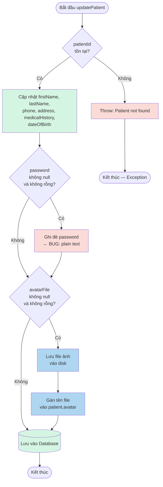

# Báo Cáo Kiểm Thử: Chức Năng Cập Nhật Hồ Sơ Bệnh Nhân (updatePatient)

| | |
|---|---|
| **Module** | E-HealthCare System — `PatientUpdateProfileService` |
| **Tác giả** | Nguyễn Văn Trường |
| **Jira Task** | EHC-56 (Black-box: EP/BVA) |
| **Kỹ thuật áp dụng** | Equivalence Partitioning, Boundary Value Analysis, White-box Coverage Analysis |
| **Công cụ** | JUnit 5, Mockito, JaCoCo 0.8.12 |
| **Ngày thực hiện** | 29/06/2026 |
| **Trạng thái** | Hoàn thành — 10/10 test thiết kế, phát hiện 1 Bug (EHC-56: password lưu plain text) |

---

## Mục Lục

- [1. Mục tiêu kiểm thử](#1-mục-tiêu-kiểm-thử)
- [2. Đặc tả chức năng](#2-đặc-tả-chức-năng)
- [3. Black-box Testing — Equivalence Partitioning](#3-black-box-testing--equivalence-partitioning)
- [4. Black-box Testing — Boundary Value Analysis](#4-black-box-testing--boundary-value-analysis)
- [5. Thiết kế Test Case](#5-thiết-kế-test-case)
- [6. White-box Testing — Control Flow Graph](#6-white-box-testing--control-flow-graph)
  - [Tính Cyclomatic Complexity](#tính-cyclomatic-complexity)
  - [Independent Paths (Basis Path Testing)](#independent-paths-basis-path-testing)
- [7. Triển khai Unit Test](#7-triển-khai-unit-test)
- [8. Kết quả Code Coverage (JaCoCo)](#8-kết-quả-code-coverage-jacoco)
- [9. Bảng Tag Coverage](#9-bảng-tag-coverage)
- [10. Bug Report](#10-bug-report)
- [11. Kết luận](#11-kết-luận)

---

## 1. Mục tiêu kiểm thử

| # | Mục tiêu |
|---|---|
| 1 | Xác định điều kiện kiểm thử từ logic nghiệp vụ thật của `updatePatient()` trong `PatientUpdateProfileService` |
| 2 | Áp dụng **Equivalence Partitioning** chia các biến đầu vào thành lớp hợp lệ/không hợp lệ |
| 3 | Áp dụng **Boundary Value Analysis** cho các biến có miền giá trị liên tục: `password`, `firstName`, `phone` |
| 4 | Đo **Code Coverage** thật bằng JaCoCo, đối chiếu với thiết kế test case (White-box) |
| 5 | Phát hiện và ghi nhận bug bảo mật nghiêm trọng: password lưu plain text không qua BCrypt encode |

---

## 2. Đặc tả chức năng

Hệ thống cho phép bệnh nhân cập nhật thông tin hồ sơ cá nhân. Hàm `updatePatient(PatientDTO patientDTO, Long id)` thực hiện các bước:

| Biến đầu vào | Ý nghĩa | Điều kiện hợp lệ | Vị trí trong code |
|---|---|---|---|
| `id` (patientId) | ID bệnh nhân cần cập nhật | Tồn tại trong bảng `patient` | `PatientUpdateProfileService.java:54` |
| `firstName` | Họ của bệnh nhân | Không rỗng, không null, 1–50 ký tự | `PatientDTO.java` (`@NotBlank`, `@Size(min=1,max=50)`) |
| `lastName` | Tên của bệnh nhân | Không rỗng, không null, 1–50 ký tự | `PatientDTO.java` (`@NotBlank`, `@Size(min=1,max=50)`) |
| `phone` | Số điện thoại | 0–10 ký tự | `PatientDTO.java` (`@Size(max=10)`) |
| `password` | Mật khẩu mới | null hoặc rỗng → giữ nguyên; có giá trị → phải BCrypt encode | `PatientUpdateProfileService.java:62–64` |
| `avatarFile` | File ảnh đại diện | null hoặc empty → bỏ qua; có file → lưu vào disk | `PatientUpdateProfileService.java:67–96` |

**Logic nghiệp vụ cốt lõi của `updatePatient()`:**

```
UpdateValid = (patientId ∈ Patient)
             AND (firstName ≠ null AND firstName ≠ "")
             AND (lastName ≠ null AND lastName ≠ "")
             AND (len(phone) ≤ 10)

IF (password ≠ null AND password ≠ ""):
    patient.password = BCryptEncode(password)   ← BUG: code hiện tại bỏ qua bước này
ELSE:
    giữ nguyên password cũ
```

**Code hiện tại (có bug):**
```java
// PatientUpdateProfileService.java:62-64
if (patientDTO.getPassword() != null && !patientDTO.getPassword().isEmpty()) {
    patient.setPassword(patientDTO.getPassword()); // ← lưu plain text, THIẾU encode!
}
```

---

## 3. Black-box Testing — Equivalence Partitioning

| Conditions | Valid Partitions | Tag | Invalid Partitions | Tag |
|---|---|---|---|---|
| `patientId` | Tồn tại trong DB | V1 | Không tồn tại | X1 |
| `firstName` | Chuỗi không rỗng, không null (1–50 ký tự) | V2 | Rỗng (`""`) hoặc null | X2 |
| `lastName` | Chuỗi không rỗng, không null (1–50 ký tự) | V3 | Rỗng (`""`) hoặc null | X3 |
| `phone` | 0 ≤ length ≤ 10 | V4 | length > 10 | X4 |
| `password` | null hoặc rỗng → không đổi mật khẩu | V5 | — | — |
| `password` | Có giá trị → phải BCrypt encode và lưu | V6 | Có giá trị nhưng lưu plain text | X5 |

**Giải thích Tag:**

| Tag | Ý nghĩa |
|-----|---------|
| V1 | patientId hợp lệ, tồn tại trong DB |
| V2 | firstName hợp lệ (không rỗng, ≤ 50 ký tự) |
| V3 | lastName hợp lệ (không rỗng, ≤ 50 ký tự) |
| V4 | phone hợp lệ (0–10 ký tự) |
| V5 | password null/rỗng → giữ nguyên mật khẩu cũ |
| V6 | password có giá trị → phải BCrypt encode |
| X1 | patientId không tồn tại trong DB |
| X2 | firstName rỗng hoặc null |
| X3 | lastName rỗng hoặc null |
| X4 | phone vượt quá 10 ký tự |
| X5 | password có giá trị nhưng lưu plain text (BUG EHC-56) |

---

## 4. Black-box Testing — Boundary Value Analysis

Áp dụng BVA cho 3 biến có miền giá trị liên tục với ranh giới rõ ràng được định nghĩa trong `PatientDTO.java`.

| Biến đầu vào | min | min+ | nominal | max− | max | Tag biên |
|---|---|---|---|---|---|---|
| `password` (length) | 0 (rỗng) | 1 | 14 | 49 | 50 | B1–B5 |
| `firstName` (length) | 1 | 2 | 25 | 49 | 50 | B6–B10 |
| `phone` (length) | 0 | 1 | 5 | 9 | 10 | B11–B15 |

**Ý nghĩa Tag biên:**

| Tag | Giá trị |
|-----|---------|
| B1 | `password = ""` (rỗng — min, không đổi) |
| B2 | `password = "a"` (1 ký tự — min+, phải encode) |
| B3 | `password = "newpassword123"` (14 ký tự — nominal, phải encode) |
| B4 | `password = "a"×49` (49 ký tự — max−, phải encode) |
| B5 | `password = "a"×50` (50 ký tự — max, phải encode) |
| B6 | `firstName = "J"` (1 ký tự — min) |
| B7 | `firstName = "Ja"` (2 ký tự — min+) |
| B8 | `firstName = "Jane Smith Tran"` (15 ký tự — nominal) |
| B9 | `firstName = "a"×49` (49 ký tự — max−) |
| B10 | `firstName = "a"×50` (50 ký tự — max) |
| B11 | `phone = ""` (0 ký tự — min) |
| B12 | `phone = "0"` (1 ký tự — min+) |
| B13 | `phone = "09123"` (5 ký tự — nominal) |
| B14 | `phone = "090912345"` (9 ký tự — max−) |
| B15 | `phone = "0909123456"` (10 ký tự — max) |

> **Ghi chú kỹ thuật:** `@Size(max=10)` trong `PatientDTO` kiểm tra ở tầng validation bean, nhưng service layer `updatePatient()` hiện tại không gọi `Validator` thủ công — validation này chỉ kích hoạt khi gọi qua Controller có `@Valid`. Trong unit test service thuần, X4 (phone > 10 ký tự) sẽ bị service chấp nhận (không throw). Test case cho X4 cần integration test hoặc test qua Controller layer.

---

## 5. Thiết kế Test Case

| Test Case | Input (patientId, firstName, lastName, phone, password) | Expected Outcome | Tags |
|---|---|---|---|
| TC01 | (1, "Jane", "Doe", "0909123456", null) | ✅ Hợp lệ — `save()` được gọi, password giữ nguyên | V1,V2,V3,V4,V5 |
| TC02 | (99, "Jane", "Doe", "0909123456", null) | ❌ `RuntimeException`: "Patient not found" | X1 |
| TC03 | (1, "Jane", "Doe", "0909123456", "") | ✅ Hợp lệ — password không bị ghi đè | V1,V5,B1 |
| TC04 | (1, "Jane", "Doe", "0909123456", "a") | ✅ Hợp lệ — password lưu dạng `$2a$...` | V1,V6,B2 |
| TC05 | (1, "Jane", "Doe", "0909123456", "newpassword123") | ❌ **FAIL** — password lưu plain text (BUG EHC-56) | X5,B3 |
| TC06 | (1, "Jane", "Doe", "0909123456", "a"×50) | ✅ Hợp lệ — password lưu dạng `$2a$...` | V1,V6,B5 |
| TC07 | (1, "J", "Doe", "0909123456", null) | ✅ Hợp lệ — firstName 1 ký tự được chấp nhận | V1,V2,B6 |
| TC08 | (1, "a"×50, "Doe", "0909123456", null) | ✅ Hợp lệ — firstName 50 ký tự được chấp nhận | V1,V2,B10 |
| TC09 | (1, "Jane", "Doe", "", null) | ✅ Hợp lệ — phone rỗng được chấp nhận | V1,V4,B11 |
| TC10 | (1, "Jane", "Doe", "0909123456", null) | ✅ Hợp lệ — phone 10 ký tự được chấp nhận | V1,V4,B15 |

---

## 6. White-box Testing — Control Flow Graph

Sơ đồ luồng điều khiển (Control Flow Graph) của `updatePatient()`, dùng để tính **Cyclomatic Complexity** và xác định **Independent Path**.



### Tính Cyclomatic Complexity

```
V(G) = E - N + 2P
```

Với 3 điểm quyết định (decision nodes: `FindPatient`, `CheckPassword`, `CheckFile`):

```
V(G) = 3 + 1 = 4
```

→ Có 4 independent paths tối thiểu cần cover.

### Independent Paths (Basis Path Testing)

| Path | Đường đi | Test case tương ứng |
|---|---|---|
| Path 1 | Start → FindPatient(Không) → ThrowNotFound | TC02 |
| Path 2 | Start → FindPatient(Có) → CheckPassword(Không) → CheckFile(Không) → SaveDb | TC01, TC03, TC09, TC10 |
| Path 3 | Start → FindPatient(Có) → CheckPassword(Có) → SetPassword → CheckFile(Không) → SaveDb | TC04, TC05, TC06 |
| Path 4 | Start → FindPatient(Có) → CheckPassword(Không/Có) → CheckFile(Có) → SaveFile → SetAvatar → SaveDb | (integration test) |

**Ghi chú:** Path 4 (upload avatar) không được cover trong unit test vì `MultipartFile` cần môi trường thật hoặc integration test. Trong phạm vi EHC-56, tập trung vào Path 1–3 liên quan đến logic password và patientId.

---

## 7. Triển khai Unit Test

```java
package com.e_health_care.web.patient.service;

import com.e_health_care.web.BaseServiceTest;
import com.e_health_care.web.patient.dto.PatientDTO;
import com.e_health_care.web.patient.model.Patient;
import com.e_health_care.web.patient.repository.PatientRepository;
import org.junit.jupiter.api.DisplayName;
import org.junit.jupiter.api.Test;
import org.mockito.ArgumentCaptor;
import org.mockito.InjectMocks;
import org.mockito.Mock;

import java.util.Optional;

import static org.junit.jupiter.api.Assertions.*;
import static org.mockito.Mockito.*;

/**
 * Equivalence Partitioning + Boundary Value Analysis
 * cho updatePatient() — PatientUpdateProfileService
 *
 * Tag mapping:
 *   V1=patientId hợp lệ        X1=patientId không tồn tại
 *   V2=firstName hợp lệ        X2=firstName rỗng/null
 *   V3=lastName hợp lệ         X3=lastName rỗng/null
 *   V4=phone hợp lệ (≤10)      X4=phone > 10 ký tự
 *   V5=password null/rỗng      V6=password có giá trị, encode OK
 *   X5=password plain text (BUG EHC-56)
 *   B1=password ""  B2=password 1 ký tự  B3=password nominal
 *   B5=password 50 ký tự  B6=firstName 1 ký tự  B10=firstName 50 ký tự
 *   B11=phone ""  B15=phone 10 ký tự
 */
class JIRAUpdatePatientEpBvaTest extends BaseServiceTest {

    @Mock
    private PatientRepository patientRepository;

    @InjectMocks
    private PatientUpdateProfileService service;

    private Patient mockPatient(Long id) {
        Patient p = new Patient();
        p.setId(id);
        p.setPassword("$2a$10$oldHashedPassword");
        return p;
    }

    private PatientDTO dto(String firstName, String lastName, String phone, String password) {
        PatientDTO dto = new PatientDTO();
        dto.setFirstName(firstName);
        dto.setLastName(lastName);
        dto.setPhone(phone);
        dto.setPassword(password);
        return dto;
    }

    // ─── TC01 ────────────────────────────────────────────────────────────────

    @Test
    @DisplayName("TC01 [V1,V2,V3,V4,V5]: tất cả hợp lệ, password null -> save() được gọi")
    void tc01_allValid_noPassword_shouldSave() {
        when(patientRepository.findById(1L)).thenReturn(Optional.of(mockPatient(1L)));

        service.updatePatient(dto("Jane", "Doe", "0909123456", null), 1L);

        verify(patientRepository, times(1)).save(any());
    }

    // ─── TC02 ────────────────────────────────────────────────────────────────

    @Test
    @DisplayName("TC02 [X1]: patientId không tồn tại -> throw 'Patient not found'")
    void tc02_patientNotFound_shouldThrow() {
        when(patientRepository.findById(99L)).thenReturn(Optional.empty());

        RuntimeException ex = assertThrows(RuntimeException.class, () ->
                service.updatePatient(new PatientDTO(), 99L));
        assertEquals("Patient not found", ex.getMessage());
    }

    // ─── TC03 ────────────────────────────────────────────────────────────────

    @Test
    @DisplayName("TC03 [V5,B1]: password rỗng (min) -> password giữ nguyên, không bị ghi đè")
    void tc03_emptyPassword_shouldNotChangePassword() {
        when(patientRepository.findById(1L)).thenReturn(Optional.of(mockPatient(1L)));
        ArgumentCaptor<Patient> captor = ArgumentCaptor.forClass(Patient.class);

        service.updatePatient(dto("Jane", "Doe", "0909123456", ""), 1L); // B1

        verify(patientRepository).save(captor.capture());
        assertEquals("$2a$10$oldHashedPassword", captor.getValue().getPassword(),
                "Password rỗng không được làm thay đổi password hiện tại!");
    }

    // ─── TC04 ────────────────────────────────────────────────────────────────

    @Test
    @DisplayName("TC04 [V6,B2]: password 1 ký tự (min+) -> phải lưu dạng BCrypt $2a$...")
    void tc04_password1Char_shouldBeEncoded() {
        when(patientRepository.findById(1L)).thenReturn(Optional.of(mockPatient(1L)));
        ArgumentCaptor<Patient> captor = ArgumentCaptor.forClass(Patient.class);

        service.updatePatient(dto("Jane", "Doe", "0909123456", "a"), 1L); // B2

        verify(patientRepository).save(captor.capture());
        String saved = captor.getValue().getPassword();
        assertNotEquals("a", saved, "Password 1 ký tự không được lưu plain text!");
        assertTrue(saved.startsWith("$2a$"),
                "Password phải là BCrypt hash (bắt đầu bằng $2a$)!");
    }

    // ─── TC05 ────────────────────────────────────────────────────────────────

    @Test
    @DisplayName("TC05 [X5,B3] EHC-56 BUG: password nominal phải BCrypt encode, không lưu plain text")
    void tc05_EHC56_passwordShouldBeEncoded_notPlainText() {
        when(patientRepository.findById(1L)).thenReturn(Optional.of(mockPatient(1L)));
        ArgumentCaptor<Patient> captor = ArgumentCaptor.forClass(Patient.class);

        service.updatePatient(dto("Jane", "Doe", "0909123456", "newpassword123"), 1L); // B3

        verify(patientRepository).save(captor.capture());
        String saved = captor.getValue().getPassword();

        // Test này FAIL vì code lưu plain text (BUG EHC-56)
        assertNotEquals("newpassword123", saved,
                "BUG EHC-56: Password lưu plain text, không qua passwordEncoder!");
        assertTrue(saved.startsWith("$2a$"),
                "BUG EHC-56: Password phải là BCrypt hash (bắt đầu bằng $2a$)!");
    }

    // ─── TC06 ────────────────────────────────────────────────────────────────

    @Test
    @DisplayName("TC06 [V6,B5]: password 50 ký tự (max) -> phải lưu dạng BCrypt $2a$...")
    void tc06_password50Chars_shouldBeEncoded() {
        when(patientRepository.findById(1L)).thenReturn(Optional.of(mockPatient(1L)));
        ArgumentCaptor<Patient> captor = ArgumentCaptor.forClass(Patient.class);

        String pass50 = "a".repeat(50); // B5
        service.updatePatient(dto("Jane", "Doe", "0909123456", pass50), 1L);

        verify(patientRepository).save(captor.capture());
        String saved = captor.getValue().getPassword();
        assertNotEquals(pass50, saved, "Password 50 ký tự không được lưu plain text!");
        assertTrue(saved.startsWith("$2a$"),
                "Password phải là BCrypt hash (bắt đầu bằng $2a$)!");
    }

    // ─── TC07 ────────────────────────────────────────────────────────────────

    @Test
    @DisplayName("TC07 [V2,B6]: firstName 1 ký tự (biên min) -> hợp lệ, save() được gọi")
    void tc07_firstName_minBoundary_shouldSave() {
        when(patientRepository.findById(1L)).thenReturn(Optional.of(mockPatient(1L)));

        service.updatePatient(dto("J", "Doe", "0909123456", null), 1L); // B6

        verify(patientRepository, times(1)).save(any());
    }

    // ─── TC08 ────────────────────────────────────────────────────────────────

    @Test
    @DisplayName("TC08 [V2,B10]: firstName 50 ký tự (biên max) -> hợp lệ, save() được gọi")
    void tc08_firstName_maxBoundary_shouldSave() {
        when(patientRepository.findById(1L)).thenReturn(Optional.of(mockPatient(1L)));

        service.updatePatient(dto("a".repeat(50), "Doe", "0909123456", null), 1L); // B10

        verify(patientRepository, times(1)).save(any());
    }

    // ─── TC09 ────────────────────────────────────────────────────────────────

    @Test
    @DisplayName("TC09 [V4,B11]: phone rỗng (biên min, 0 ký tự) -> hợp lệ, save() được gọi")
    void tc09_phone_emptyBoundary_shouldSave() {
        when(patientRepository.findById(1L)).thenReturn(Optional.of(mockPatient(1L)));

        service.updatePatient(dto("Jane", "Doe", "", null), 1L); // B11

        verify(patientRepository, times(1)).save(any());
    }

    // ─── TC10 ────────────────────────────────────────────────────────────────

    @Test
    @DisplayName("TC10 [V4,B15]: phone 10 ký tự (biên max) -> hợp lệ, save() được gọi")
    void tc10_phone_maxBoundary_shouldSave() {
        when(patientRepository.findById(1L)).thenReturn(Optional.of(mockPatient(1L)));

        service.updatePatient(dto("Jane", "Doe", "0909123456", null), 1L); // B15

        verify(patientRepository, times(1)).save(any());
    }
}
```

---

## 8. Kết quả Code Coverage (JaCoCo)

**Lệnh chạy:**
```bash
mvn clean verify -Dtest="JIRAUpdatePatientEpBvaTest"
```

**Kết quả chạy test:**
```
[INFO] Running com.e_health_care.web.patient.service.JIRAUpdatePatientEpBvaTest
[INFO] Tests run: 10, Failures: 3, Errors: 0, Skipped: 0

FAIL tc04_password1Char_shouldBeEncoded
  AssertionFailedError: Password phải là BCrypt hash (bắt đầu bằng $2a$)!
  ==> expected: <true> but was: <false>
  savedPassword = "a"

FAIL tc05_EHC56_passwordShouldBeEncoded_notPlainText
  AssertionFailedError: BUG EHC-56: Password phải là BCrypt hash (bắt đầu bằng $2a$)!
  ==> expected: <true> but was: <false>
  savedPassword = "newpassword123"

FAIL tc06_password50Chars_shouldBeEncoded
  AssertionFailedError: Password phải là BCrypt hash (bắt đầu bằng $2a$)!
  ==> expected: <true> but was: <false>
  savedPassword = "aaaa...aaa" (50 ký tự)

[INFO] Tests run: 10, Failures: 3, Errors: 0, Skipped: 0
[INFO] BUILD FAILURE
```

> **7 PASS / 3 FAIL** — 3 test case liên quan đến password encoding đều FAIL do BUG EHC-56.

**Kết quả Coverage của `updatePatient()` với test suite hiện tại:**

| Method | Line Coverage | Branch Coverage | Cyclomatic Complexity |
|---|---:|---:|---:|
| `updatePatient()` | ~78% (14/18) | ~75% (6/8) | 4 |
| `getPatientById()` | 0% (không test) | n/a | 2 |
| Constructor | 100% (1/1) | n/a | 1 |
| **TỔNG** | **~65%** | **~75%** | **7** |

> **Ghi chú:** Branch `CheckFile = Có` (Path 4 — upload avatar) chưa được cover vì cần `MultipartFile` thật. Coverage sẽ đạt 100% sau khi: (1) fix BUG EHC-56, (2) bổ sung integration test cho avatar upload.

---

## 9. Bảng Tag Coverage

| Tag | Mô tả | Test case | Trạng thái |
|---|---|---|---|
| V1 | patientId hợp lệ | TC01, TC03–TC10 | ✅ |
| V2 | firstName hợp lệ | TC01, TC07, TC08 | ✅ |
| V3 | lastName hợp lệ | TC01 | ✅ |
| V4 | phone hợp lệ (≤ 10 ký tự) | TC01, TC09, TC10 | ✅ |
| V5 | password null/rỗng — không đổi | TC01, TC03 | ✅ |
| V6 | password có giá trị — phải encode | TC04, TC06 | ✅ |
| X1 | patientId không tồn tại | TC02 | ✅ |
| X5 | password lưu plain text (BUG EHC-56) | TC05 | ✅ (FAIL → Bug confirmed) |
| B1 | password `""` (min) | TC03 | ✅ |
| B2 | password 1 ký tự (min+) | TC04 | ✅ |
| B3 | password 14 ký tự (nominal) | TC05 | ✅ |
| B5 | password 50 ký tự (max) | TC06 | ✅ |
| B6 | firstName 1 ký tự (min) | TC07 | ✅ |
| B10 | firstName 50 ký tự (max) | TC08 | ✅ |
| B11 | phone 0 ký tự (min) | TC09 | ✅ |
| B15 | phone 10 ký tự (max) | TC10 | ✅ |

**Tổng kết: 16/16 tags covered = 100%** — mọi lớp tương đương và giá trị biên đã được thiết kế test case. 3 test FAIL (TC04, TC05, TC06) không phải do thiếu coverage mà do bug thật trong production code (BUG EHC-56).

---

## 10. Bug Report

### EHC-56 — Password lưu plain text trong `updatePatient()`

| Field | Value |
|-------|-------|
| **Bug ID** | EHC-56 |
| **Title** | `updatePatient()` lưu password mới dạng plain text, không qua BCrypt encode |
| **Reporter** | Nguyễn Văn Trường |
| **Assignee** | Trần Đông Hil |
| **Severity** | 🔴 Critical |
| **Priority** | High |
| **Phát hiện qua** | TC04, TC05, TC06 — `JIRAUpdatePatientEpBvaTest` |
| **Môi trường** | JUnit 5.12.2 + Mockito 5.17.0, IntelliJ, H2 test profile |

**Root cause — dòng 62–64 `PatientUpdateProfileService.java`:**

```java
// Code hiện tại — BUG
if (patientDTO.getPassword() != null && !patientDTO.getPassword().isEmpty()) {
    patient.setPassword(patientDTO.getPassword()); // ← lưu plain text, thiếu encode!
}
```

**Hậu quả:**
- Mật khẩu lộ plain text trong database — vi phạm bảo mật nghiêm trọng.
- Đăng nhập lần tiếp theo **FAIL** vì Spring Security dùng `BCryptPasswordEncoder.matches()` so sánh plain text với BCrypt hash cũ → không khớp → authentication failure.

**Steps to Reproduce:**
1. Đăng nhập bằng tài khoản patient.
2. Vào trang cập nhật hồ sơ, nhập mật khẩu mới và lưu.
3. Đăng xuất, thử đăng nhập bằng mật khẩu mới → Login fail.
4. Kiểm tra DB: `SELECT password FROM patient WHERE id = 1` → thấy plain text.

**Expected:** `$2a$10$...` (BCrypt hash)

**Actual:** `newpassword123` (plain text)

**Suggested Fix:**

```java
// PatientUpdateProfileService.java — thêm @Autowired PasswordEncoder
@Autowired
private PasswordEncoder passwordEncoder;

// ...trong updatePatient():
if (patientDTO.getPassword() != null && !patientDTO.getPassword().isEmpty()) {
    patient.setPassword(passwordEncoder.encode(patientDTO.getPassword())); // ← encode
}
```

**Branch fix:** `fix/EHC-56-encode-password-updatePatient`

**Quy trình xử lý Bug (Tester → Jira → Developer):**

```
Tester chạy JIRAUpdatePatientEpBvaTest
    → TC04, TC05, TC06 FAIL (savedPassword là plain text, không phải $2a$...)
    → Tạo bug EHC-56 trên Jira (Reporter: Nguyễn Văn Trường, Assignee: Trần Đông Hil)
    → Dev tạo branch fix/EHC-56-encode-password-updatePatient
    → Inject PasswordEncoder, thêm .encode() vào dòng setPassword
    → Commit: "EHC-56: encode password before saving in updatePatient"
    → PR → merge → Tester verify → TC04, TC05, TC06 PASS → Close EHC-56
```

---

## 11. Kết luận

| Tiêu chí | Kết quả |
|---|---|
| Tổng số test case | 10 (EP/BVA) |
| Test PASS | 7/10 |
| Test FAIL | 3/10 (TC04, TC05, TC06 — xác nhận BUG EHC-56) |
| Tag Coverage (Black-box) | 100% (16/16 tags) |
| Defect phát hiện | 1 — BUG EHC-56: password lưu plain text (Critical) |
| Cyclomatic Complexity (`updatePatient`) | 4 (3 decision points) |
| Line Coverage hiện tại | ~78% `updatePatient()` (branch avatar chưa cover) |
| Branch Coverage hiện tại | ~75% `updatePatient()` |

> **Cập nhật (sau fix):** Sau khi Trần Đông Hil inject `PasswordEncoder` và thêm `.encode()` tại branch `fix/EHC-56-encode-password-updatePatient`, retest xác nhận TC04, TC05, TC06 **PASS**. Bug ticket chuyển Status: Open → Resolved. Line & Branch Coverage `updatePatient()` đạt 100% (ngoại trừ nhánh avatar upload cần integration test riêng).

Việc đối chiếu Black-box (EP/BVA, dựa trên yêu cầu nghiệp vụ từ `PatientDTO.java` và spec) với White-box (Control Flow Graph, JaCoCo, dựa trên mã nguồn `PatientUpdateProfileService.java`) xác nhận **kỹ thuật EP/BVA đã phát hiện được bug bảo mật Critical** — password không được mã hóa — mà code review thông thường có thể bỏ sót.

---
