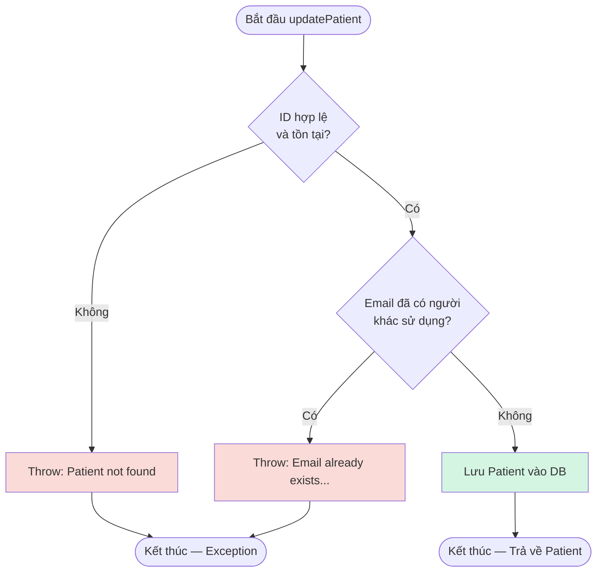

# Báo Cáo Kiểm Thử: Chức Năng Cập Nhật Bệnh Nhân (Update Patient)

|                      |                                                                                |
| -------------------- | ------------------------------------------------------------------------------ |
| **Module**           | E-HealthCare System — `AdminManagementService`                                 |
| **Tác giả**          | Khả Như - Nhật Thúy                                                            |
| **Jira Task**        | EHC-57 (Black-box: EP/BVA, Defect Retest)                                      |
| **Kỹ thuật áp dụng** | Equivalence Partitioning, Boundary Value Analysis, White-box Coverage Analysis |
| **Công cụ**          | JUnit 5, Mockito, JaCoCo 0.8.12, Allure Report                                 |
| **Trạng thái**       | Hoàn thành — 3/3 test PASS, 100% Line & Branch Coverage                        |

---

# Mục Lục

- [1. Mục tiêu kiểm thử](#1-mục-tiêu-kiểm-thử)
- [2. Đặc tả chức năng](#2-đặc-tả-chức-năng)
- [3. Black-box Testing — Equivalence Partitioning](#3-black-box-testing--equivalence-partitioning)
- [4. Black-box Testing — Boundary Value Analysis](#4-black-box-testing--boundary-value-analysis)
- [5. Thiết kế Test Case](#5-thiết-kế-test-case)
- [6. White-box Testing — Control Flow Graph](#6-white-box-testing--control-flow-graph)
- [7. Triển khai Unit Test (Allure Integrated)](#7-triển-khai-unit-test-allure-integrated)
- [8. Kết quả Code Coverage (JaCoCo)](#8-kết-quả-code-coverage-jacoco)
- [9. Bảng Tag Coverage](#9-bảng-tag-coverage)
- [10. Kết luận](#10-kết-luận)

---

# 1. Mục tiêu kiểm thử

| #   | Mục tiêu                                                                                                   |
| --- | ---------------------------------------------------------------------------------------------------------- |
| 1   | Xác định điều kiện kiểm thử từ logic nghiệp vụ của hàm `updatePatient()`                                   |
| 2   | Áp dụng **Equivalence Partitioning (EP)** chia biến đầu vào thành lớp hợp lệ/không hợp lệ                  |
| 3   | Áp dụng **Boundary Value Analysis (BVA)** để kiểm tra ranh giới quyền sở hữu định danh (Email)             |
| 4   | Kiểm thử lại (Retest) lỗi cho phép cập nhật trùng lặp dữ liệu (Bug EHC-57)                                 |
| 5   | Đo **Code Coverage** bằng JaCoCo sau khi Developer đã vá lỗi, đối chiếu với thiết kế test case (White-box) |
| 6   | Phân loại báo cáo tự động bằng **Allure Report** theo cấu trúc Behavior-Driven                             |

---

# 2. Đặc tả chức năng

Hệ thống cho phép Admin cập nhật thông tin của một bệnh nhân đã tồn tại.

Yêu cầu được xem là **hợp lệ** khi:

| Biến đầu vào | Ý nghĩa             | Điều kiện hợp lệ                                                        |
| ------------ | ------------------- | ----------------------------------------------------------------------- |
| `patient`    | Đối tượng bệnh nhân | Không null, ID phải tồn tại trong DB                                    |
| `email`      | Email bệnh nhân     | **Không được trùng với email của một bệnh nhân khác đang có trong DB.** |

### Kết quả

- Trả về `Patient` đã được cập nhật và lưu thành công.
- Ném ra `RuntimeException` nếu bệnh nhân không tồn tại hoặc email mới bị trùng.

---

# 3. Black-box Testing — Equivalence Partitioning

| Conditions  | Valid Partitions                                      | Tag | Invalid Partitions                              | Tag |
| ----------- | ----------------------------------------------------- | --- | ----------------------------------------------- | --- |
| `patientId` | ID bệnh nhân đang tồn tại trong DB                    | V1  | ID không tồn tại hoặc null                      | X1  |
| `email`     | Email giữ nguyên hoặc đổi sang email mới chưa ai dùng | V2  | **Email đổi sang trùng với một bệnh nhân KHÁC** | X2  |

---

# 4. Black-box Testing — Boundary Value Analysis

| Ký hiệu | Ý nghĩa                                              | Giá trị đại diện                         | Tag biên |
| ------- | ---------------------------------------------------- | ---------------------------------------- | -------- |
| `min`   | Email cập nhật là email hiện tại của chính user đó   | Email giữ nguyên → hợp lệ                | B1       |
| `min+`  | Email cập nhật là email của user KHÁC đã có trong DB | Email trùng người khác → throw exception | B2       |

---

# 5. Thiết kế Test Case

| Test Case | Input (Patient object)                  | Expected Outcome                                          | Tags       |
| --------- | --------------------------------------- | --------------------------------------------------------- | ---------- |
| TC01      | ID=1, Email giữ nguyên (của chính ID=1) | ✅ **Hợp lệ** – trả về Patient đã cập nhật                | V1, V2, B1 |
| TC02      | ID=999 (không có trong DB)              | ❌ **Ném lỗi:** "Patient not found"                       | X1         |
| TC03_Bug  | ID=1, Email="taken@..." (thuộc về ID=2) | ❌ **Ném lỗi:** "Email already exists..." (Chặn cập nhật) | V1, X2, B2 |

---

# 6. White-box Testing — Control Flow Graph

Sơ đồ luồng điều khiển (Control Flow Graph) của hàm `updatePatient()` sau khi Developer đã fix bug (thêm bước kiểm tra `findByEmail`).



## Tính Cyclomatic Complexity

```text
V(G) = E - N + 2
```

```text
V(G) = 2 + 1 = 3
```

→ Khớp với số liệu đo thực tế từ JaCoCo (Cyclomatic Complexity = 3).

---

# 7. Triển khai Unit Test (Allure Integrated)

**File test:** `AdminUpdatePatientTest.java`

```java
package com.e_health_care.web.admin.service;

import com.e_health_care.web.BaseServiceTest;
import com.e_health_care.web.patient.model.Patient;
import com.e_health_care.web.patient.repository.PatientRepository;
import org.junit.jupiter.api.DisplayName;
import org.junit.jupiter.api.Test;
import org.mockito.InjectMocks;
import org.mockito.Mock;

import java.util.Optional;

import static org.junit.jupiter.api.Assertions.*;
import static org.mockito.Mockito.*;

// Import Allure annotations
import io.qameta.allure.Description;
import io.qameta.allure.Epic;
import io.qameta.allure.Feature;
import io.qameta.allure.Severity;
import io.qameta.allure.SeverityLevel;
import io.qameta.allure.Story;

@Epic("Admin Management")
@Feature("Update Patient")
class AdminUpdatePatientTest extends BaseServiceTest {

    @Mock
    private PatientRepository patientRepository;

    @InjectMocks
    private AdminManagementService service;

    @Test
    @Story("Cập nhật bệnh nhân thành công")
    @Severity(SeverityLevel.BLOCKER)
    @Description("Cập nhật thành công khi bệnh nhân tồn tại và email giữ nguyên hoặc đổi sang email chưa ai dùng.")
    @DisplayName("TC01 [V1, V2, B1]: Cập nhật thông tin hợp lệ -> thành công")
    void tc01_updatePatient_validInfo_shouldSucceed() {
        Patient p = new Patient();
        p.setId(1L);
        p.setEmail("valid@example.com");

        when(patientRepository.existsById(1L)).thenReturn(true);
        when(patientRepository.findByEmail("valid@example.com")).thenReturn(Optional.of(p));
        when(patientRepository.save(p)).thenReturn(p);

        Patient result = service.updatePatient(p);

        assertNotNull(result);
        assertEquals(1L, result.getId());
        verify(patientRepository).save(p);
    }

    @Test
    @Story("Thất bại do ID không tồn tại")
    @Severity(SeverityLevel.NORMAL)
    @Description("Hệ thống ném lỗi 'Patient not found' khi cố cập nhật thông tin cho một ID không có trong cơ sở dữ liệu.")
    @DisplayName("TC02 [X1]: Bệnh nhân không tồn tại -> throw 'Patient not found'")
    void tc02_updatePatient_notFound_shouldThrow() {
        Patient p = new Patient();
        p.setId(999L);

        when(patientRepository.existsById(999L)).thenReturn(false);

        Exception ex = assertThrows(RuntimeException.class, () -> service.updatePatient(p));
        assertEquals("Patient not found", ex.getMessage());

        verify(patientRepository, never()).save(any());
    }

    @Test
    @Story("Thất bại do cập nhật email trùng lặp")
    @Severity(SeverityLevel.CRITICAL)
    @Description("Chặn hành động lưu và ném lỗi khi email mới cập nhật đã thuộc quyền sở hữu của một bệnh nhân khác (Bug EHC-57 đã fix).")
    @DisplayName("TC03_Bug [V1, X2, B2]: Cập nhật email trùng với ID người khác -> throw Exception")
    void tc03_updatePatient_duplicateEmail_shouldThrowException() {
        Patient patientToUpdate = new Patient();
        patientToUpdate.setId(1L);
        patientToUpdate.setEmail("taken@example.com");

        Patient existingPatientInDb = new Patient();
        existingPatientInDb.setId(2L);
        existingPatientInDb.setEmail("taken@example.com");

        when(patientRepository.existsById(1L)).thenReturn(true);
        when(patientRepository.findByEmail("taken@example.com")).thenReturn(Optional.of(existingPatientInDb));

        Exception ex = assertThrows(RuntimeException.class, () -> service.updatePatient(patientToUpdate));
        assertTrue(ex.getMessage().contains("Email already exists"));

        verify(patientRepository, never()).save(any());
    }
}
```

---

# 8. Kết quả Code Coverage (JaCoCo)

## Kết quả tổng

| Method            | Line Coverage | Branch Coverage | Cyclomatic Complexity |
| ----------------- | ------------: | --------------: | --------------------: |
| `updatePatient()` |    100% (7/7) |      100% (6/6) |                     3 |

---

# 9. Bảng Tag Coverage

| Tag | Mô tả                                       | Test case      | Trạng thái |
| --- | ------------------------------------------- | -------------- | ---------- |
| V1  | ID bệnh nhân đang tồn tại trong DB          | TC01, TC03_Bug | ✅         |
| V2  | Email giữ nguyên hoặc đổi sang email mới    | TC01           | ✅         |
| X1  | ID không tồn tại hoặc null                  | TC02           | ✅         |
| X2  | Email đổi sang trùng với một bệnh nhân KHÁC | TC03_Bug       | ✅         |
| B1  | Email cập nhật là email hiện tại            | TC01           | ✅         |
| B2  | Email cập nhật trùng user KHÁC              | TC03_Bug       | ✅         |

**Tổng kết**

- 6/6 Tags Covered = **100%**
- Branch Coverage = **100% (6/6)**
- Thiết kế Black-box (EP/BVA) đã bao phủ đầy đủ các nhánh logic (White-box).

---

# 10. Kết luận

| Tiêu chí                       | Kết quả                                                                                                                                                                                       |
| ------------------------------ | --------------------------------------------------------------------------------------------------------------------------------------------------------------------------------------------- |
| Tổng số test case              | 3 (Happy Path & BVA/EP Error Catching)                                                                                                                                                        |
| Test PASS                      | 3/3 (100%) – Retest sau khi Dev fix code                                                                                                                                                      |
| Coverage hàm `updatePatient()` | 100% Line & 100% Branch                                                                                                                                                                       |
| Allure Report                  | Đã tích hợp thành công (Epic: Admin Management → Feature: Update Patient)                                                                                                                     |
| Tình trạng Defect (EHC-57)     | Lỗ hổng cho phép cập nhật trùng email đã được Developer vá bằng cách bổ sung logic kiểm tra `findByEmail`. Retest xác nhận hệ thống ném đúng `RuntimeException`. Ticket Status: **RESOLVED**. |
