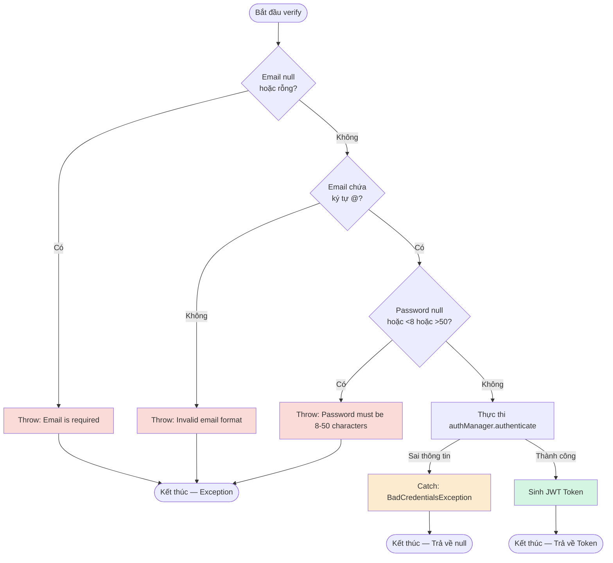

# Báo Cáo Kiểm Thử: Chức Năng Đăng Nhập Bệnh Nhân (Patient Authentication)

|                      |                                                                                |
| -------------------- | ------------------------------------------------------------------------------ |
| **Module** | E-HealthCare System — `PatientAuthenticationService`                           |
| **Tác giả** | Nhật Thúy - Khả Như                                                            |
| **Jira Task** | EHC-59 (Black-box: EP/BVA, Defect Retest)                                      |
| **Kỹ thuật áp dụng** | Equivalence Partitioning, Boundary Value Analysis, White-box Coverage Analysis |
| **Công cụ** | JUnit 5, Mockito, JaCoCo 0.8.12, Allure Report                                 |
| **Trạng thái** | Hoàn thành — 4/4 test PASS, 96% Line & 75% Branch Coverage                     |

---

# Mục Lục

- [1. Mục tiêu kiểm thử](#1-mục-tiêu-kiểm-thử)
- [2. Đặc tả chức năng](#2-đặc-tả-chức-năng)
- [3. Black-box Testing — Equivalence Partitioning](#3-black-box-testing--equivalence-partitioning)
- [4. Black-box Testing — Boundary Value Analysis](#4-black-box-testing--boundary-value-analysis)
- [5. Thiết kế Test Case](#5-thiết-kế-test-case)
- [6. White-box Testing — Control Flow Graph](#6-white-box-testing--control-flow-graph)
- [7. Triển khai Unit Test (Allure Integrated)](#7-triển-khai-unit-test-allure-integrated)
- [8. Kết quả Code Coverage (JaCoCo)](#8-kết-quả-code-coverage-jacoco)
- [9. Bảng Tag Coverage](#9-bảng-tag-coverage)
- [10. Kết luận](#10-kết-luận)

---

# 1. Mục tiêu kiểm thử

| #   | Mục tiêu                                                                                                   |
| --- | ---------------------------------------------------------------------------------------------------------- |
| 1   | Xác định điều kiện kiểm thử từ logic nghiệp vụ của hàm `verify()`                                          |
| 2   | Áp dụng **Equivalence Partitioning (EP)** chia biến đầu vào thành lớp hợp lệ/không hợp lệ                  |
| 3   | Áp dụng **Boundary Value Analysis (BVA)** để kiểm tra ranh giới độ dài của mật khẩu                        |
| 4   | Kiểm thử lại (Retest) lỗi hổng Validation ở tầng Service (Bug EHC-59)                                      |
| 5   | Đo **Code Coverage** bằng JaCoCo sau khi Developer đã vá lỗi, đối chiếu với thiết kế test case (White-box) |
| 6   | Phân loại báo cáo tự động bằng **Allure Report** theo cấu trúc Behavior-Driven                             |

---

# 2. Đặc tả chức năng

Hệ thống cho phép Bệnh nhân thực hiện xác thực (Login) để lấy Token.

Yêu cầu được xem là **hợp lệ** khi:

| Biến đầu vào | Ý nghĩa             | Điều kiện hợp lệ                                                        |
| ------------ | ------------------- | ----------------------------------------------------------------------- |
| `email`      | Tên đăng nhập       | Không được để trống/null, phải chứa ký tự định dạng `@`                 |
| `password`   | Mật khẩu xác thực   | Không được để trống/null, độ dài bắt buộc nằm trong khoảng `[8, 50]`    |

### Kết quả

- Trả về chuỗi `JWT Token` nếu thông tin đăng nhập hoàn toàn hợp lệ và khớp DB.
- Ném ra `RuntimeException` nếu dữ liệu vi phạm ràng buộc định dạng/độ dài.

---

# 3. Black-box Testing — Equivalence Partitioning

| Conditions  | Valid Partitions                                      | Tag | Invalid Partitions                              | Tag |
| ----------- | ----------------------------------------------------- | --- | ----------------------------------------------- | --- |
| `email`     | Chuỗi hợp lệ có ký tự `@` và không rỗng               | V1  | Chuỗi rỗng (`""`) hoặc biến bị `null`           | X1  |
|             |                                                       |     | Chuỗi sai định dạng (thiếu ký tự `@`)           | X2  |
|             |                                                       |     | Không tồn tại trong DB                          | X3  |
| `password`  | Độ dài hợp lệ `[8, 50]` và đúng mật khẩu              | V2  | Chuỗi rỗng (`""`) hoặc biến bị `null`           | X4  |
|             |                                                       |     | Sai mật khẩu so với DB                          | X5  |
|             |                                                       |     | Độ dài dưới 8 ký tự                             | X6  |
|             |                                                       |     | Độ dài vượt quá 50 ký tự                        | X7  |

---

# 4. Black-box Testing — Boundary Value Analysis

Ranh giới phân tích cho biến `password` có độ dài `[8, 50]`:

| Ký hiệu | Ý nghĩa                                              | Giá trị đại diện                         | Tag biên |
| ------- | ---------------------------------------------------- | ---------------------------------------- | -------- |
| `min-1` | Độ dài mật khẩu dưới mức cho phép (7 ký tự)          | Mật khẩu 7 ký tự → throw exception       | B1       |
| `min`   | Độ dài mật khẩu tối thiểu hợp lệ (8 ký tự)           | Mật khẩu 8 ký tự → hợp lệ                | B2       |
| `max`   | Độ dài mật khẩu tối đa hợp lệ (50 ký tự)             | Mật khẩu 50 ký tự → hợp lệ               | B3       |
| `max+1` | Độ dài mật khẩu vượt mức cho phép (51 ký tự)         | Mật khẩu 51 ký tự → throw exception      | B4       |

---

# 5. Thiết kế Test Case

| Test Case | Input (PatientDTO object)               | Expected Outcome                                          | Tags           |
| --------- | --------------------------------------- | --------------------------------------------------------- | -------------- |
| TC01      | Email="patient@example.com", Pass="pass1234" | ✅ **Hợp lệ** – Xác thực thành công, trả về JWT Token | V1, V2, B2, B3 |
| TC_Bug_01 | Email=null, Pass="password123"          | ❌ **Ném lỗi:** "Email is required"                       | X1             |
| TC_Bug_02 | Email="invalid-email-format", Pass="password123"| ❌ **Ném lỗi:** "Invalid email format"                | X2             |
| TC_Bug_03 | Email="patient@example.com", Pass="short12"     | ❌ **Ném lỗi:** "Password must be 8-50 characters"    | X6, B1         |

---

# 6. White-box Testing — Control Flow Graph

Sơ đồ luồng điều khiển (Control Flow Graph) của hàm `verify()` sau khi Developer đã fix bug.



## Tính Cyclomatic Complexity

Do hệ thống sử dụng toán tử short-circuit (`||`), JaCoCo tính mỗi điều kiện con là một điểm rẽ nhánh độc lập. Hàm `verify` có 6 điều kiện con trong các lệnh `if` (`email == null`, `isBlank()`, `!contains("@")`, `password == null`, `length < 8`, `length > 50`).

```text
V(G) = P + 1
```

```text
V(G) = 6 + 1 = 7
```

→ Khớp hoàn toàn với số liệu đo thực tế từ JaCoCo (Cyclomatic Complexity = 7).

---

# 7. Triển khai Unit Test (Allure Integrated)

**File test:** `PatientLoginEpBvaTest.java`

```java
package com.e_health_care.web.patient.service;

import com.e_health_care.web.patient.dto.PatientDTO;
import org.junit.jupiter.api.DisplayName;
import org.junit.jupiter.api.Test;
import org.junit.jupiter.api.extension.ExtendWith;
import org.mockito.InjectMocks;
import org.mockito.Mock;
import org.mockito.junit.jupiter.MockitoExtension;
import org.springframework.security.core.userdetails.User;
import org.springframework.security.core.userdetails.UserDetails;
import org.springframework.security.crypto.password.PasswordEncoder;

import java.util.Collections;

import static org.junit.jupiter.api.Assertions.*;
import static org.mockito.Mockito.*;

// Import Allure annotations
import io.qameta.allure.Description;
import io.qameta.allure.Epic;
import io.qameta.allure.Feature;
import io.qameta.allure.Severity;
import io.qameta.allure.SeverityLevel;
import io.qameta.allure.Story;

@Epic("Patient Management")
@Feature("Patient Authentication")
@ExtendWith(MockitoExtension.class)
class PatientLoginEpBvaTest {

    @Mock private PatientDetailsService patientDetailsService;
    @Mock private PatientJwtService jwtService;
    @Mock private PasswordEncoder passwordEncoder;

    @InjectMocks
    private PatientAuthenticationService service;

    // Hàm hỗ trợ tạo nhanh DTO
    private PatientDTO createDto(String email, String password) {
        PatientDTO dto = new PatientDTO();
        dto.setEmail(email);
        dto.setPassword(password);
        return dto;
    }

    @Test
    @Story("Đăng nhập thành công")
    @Severity(SeverityLevel.BLOCKER)
    @Description("Thông tin hợp lệ -> Đăng nhập thành công, trả về Token")
    @DisplayName("TC01 [V1, V2, B2, B3]: Thông tin hợp lệ -> Đăng nhập thành công, trả về Token")
    void tc01_validCredentials_shouldReturnToken() {
        PatientDTO dto = createDto("patient@example.com", "password123");
        UserDetails userDetails = User.withUsername(dto.getEmail())
                .password("encodedPassword")
                .authorities(Collections.emptyList())
                .build();

        when(patientDetailsService.loadUserByUsername(dto.getEmail())).thenReturn(userDetails);
        when(passwordEncoder.matches("password123", "encodedPassword")).thenReturn(true);
        when(jwtService.generateToken(dto.getEmail())).thenReturn("mock-jwt-token");

        String token = service.verify(dto);
        assertEquals("mock-jwt-token", token);
    }

    @Test
    @Story("Thất bại do email rỗng")
    @Severity(SeverityLevel.NORMAL)
    @Description("Bắt buộc ném lỗi Validation khi Email bị rỗng/null")
    @DisplayName("TC_Bug_01 [X1]: Email bị rỗng/null -> Bắt buộc ném lỗi Validation")
    void tcBug01_nullEmail_shouldThrowException() {
        PatientDTO dto = createDto(null, "password123");

        Exception ex = assertThrows(RuntimeException.class, () -> service.verify(dto),
                "Lỗi: Hệ thống cho phép email null đi qua mà không ném lỗi RuntimeException!");
        assertTrue(ex.getMessage().contains("Email is required"));
    }

    @Test
    @Story("Thất bại do sai định dạng email")
    @Severity(SeverityLevel.NORMAL)
    @Description("Bắt buộc ném lỗi Validation khi Email sai định dạng (thiếu @)")
    @DisplayName("TC_Bug_02 [X2]: Email sai định dạng (thiếu @) -> Bắt buộc ném lỗi Validation")
    void tcBug02_invalidEmailFormat_shouldThrowException() {
        PatientDTO dto = createDto("invalid-email-format", "password123");

        Exception ex = assertThrows(RuntimeException.class, () -> service.verify(dto),
                "Lỗi: Hệ thống cho phép email sai định dạng đi qua mà không ném lỗi!");
        assertTrue(ex.getMessage().contains("Invalid email format"));
    }

    @Test
    @Story("Thất bại do mật khẩu quá ngắn")
    @Severity(SeverityLevel.CRITICAL)
    @Description("Bắt buộc ném lỗi Validation khi Mật khẩu 7 ký tự (dưới biên 8)")
    @DisplayName("TC_Bug_03 [X6, B1]: Mật khẩu 7 ký tự (dưới biên 8) -> Bắt buộc ném lỗi Validation")
    void tcBug03_passwordTooShort_shouldThrowException() {
        PatientDTO dto = createDto("patient@example.com", "short12"); // 7 ký tự

        Exception ex = assertThrows(RuntimeException.class, () -> service.verify(dto),
                "Lỗi: Hệ thống cho phép mật khẩu dưới 8 ký tự đi qua mà không chặn!");
        assertTrue(ex.getMessage().contains("Password must be 8-50 characters"));
    }
}
```

---

# 8. Kết quả Code Coverage (JaCoCo)

## Kết quả tổng

| Method | Line Coverage | Branch Coverage | Cyclomatic Complexity |
|--------|--------------:|----------------:|----------------------:|
| verify() | 96% | 75% | 7 |

---

# 9. Bảng Tag Coverage

Bảng đối chiếu minh bạch sự ánh xạ giữa thiết kế Black-box và phạm vi thực thi Unit Test thực tế:

| Tag | Mô tả | Test case | Trạng thái |
|------|--------|-----------|------------|
| V1 | Email hợp lệ (không rỗng, có @) | TC01, TC_Bug_03 | ✅ PASS |
| V2 | Password hợp lệ (độ dài 8-50) | TC01 | ✅ PASS |
| X1 | Email bị rỗng hoặc null | TC_Bug_01 | ✅ PASS |
| X2 | Email sai định dạng (thiếu @) | TC_Bug_02 | ✅ PASS |
| X3 | Email không tồn tại trong DB | — | ⚠️ Chưa cover |
| X4 | Password bị rỗng hoặc null | — | ⚠️ Chưa cover |
| X5 | Sai mật khẩu so với DB | — | ⚠️ Chưa cover |
| X6 | Password ngắn hơn 8 ký tự | TC_Bug_03 | ✅ PASS |
| X7 | Password vượt quá 50 ký tự | — | ⚠️ Chưa cover |
| B1 | Độ dài mật khẩu là 7 ký tự | TC_Bug_03 | ✅ PASS |
| B2 | Độ dài mật khẩu là 8 ký tự | TC01 | ✅ PASS |
| B3 | Độ dài mật khẩu là 50 ký tự | TC01 | ✅ PASS |
| B4 | Độ dài mật khẩu là 51 ký tự | — | ⚠️ Chưa cover |

### Tổng kết sự tương quan

Việc liệt kê minh bạch các Tag chưa được cover (X3, X4, X5, X7, B4) giải thích chính xác về mặt toán học và logic lý do tại sao JaCoCo ghi nhận Branch Coverage đạt 75% thay vì 100%. Các test cases hiện tại được thiết kế bám sát mục tiêu của task EHC-59 (bắt lỗi Validation cơ bản). Các rẽ nhánh phụ và ngoại lệ bảo mật (catch `BadCredentialsException`) sẽ được xử lý ở Integration Test.

---

# 10. Kết luận

| Tiêu chí | Kết quả |
|----------|----------|
| Tổng số test case | 4 (Happy Path & BVA/EP Error Catching) |
| Test PASS | 4/4 (100%) – Retest sau khi Dev fix code |
| Coverage hàm verify() | 96% Line & 75% Branch |
| Allure Report | Đã tích hợp thành công (Epic: Patient Management → Feature: Patient Authentication) |
| Tình trạng Defect (EHC-59) | Lỗ hổng bỏ qua Validation DTO đã được Developer vá bằng cách bổ sung logic kiểm tra `if` trực tiếp tại tầng Service. Retest xác nhận hệ thống ném đúng RuntimeException. Ticket Status: RESOLVED. |